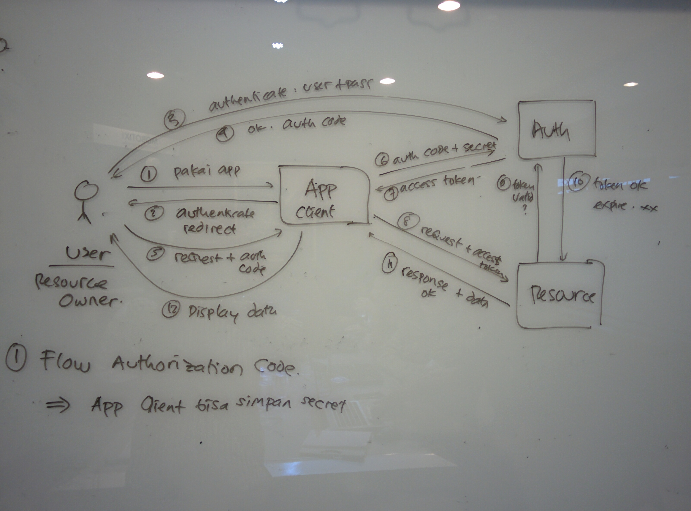
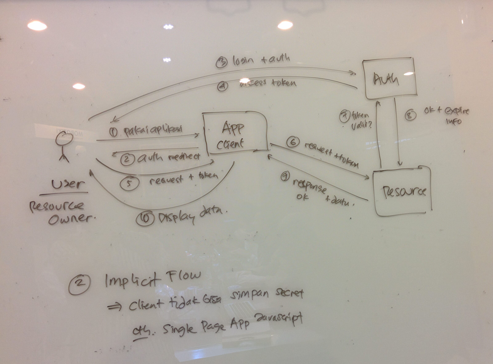
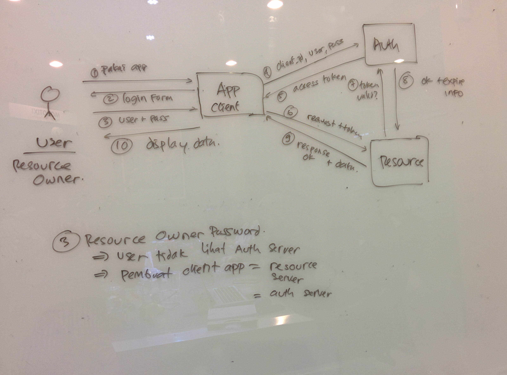
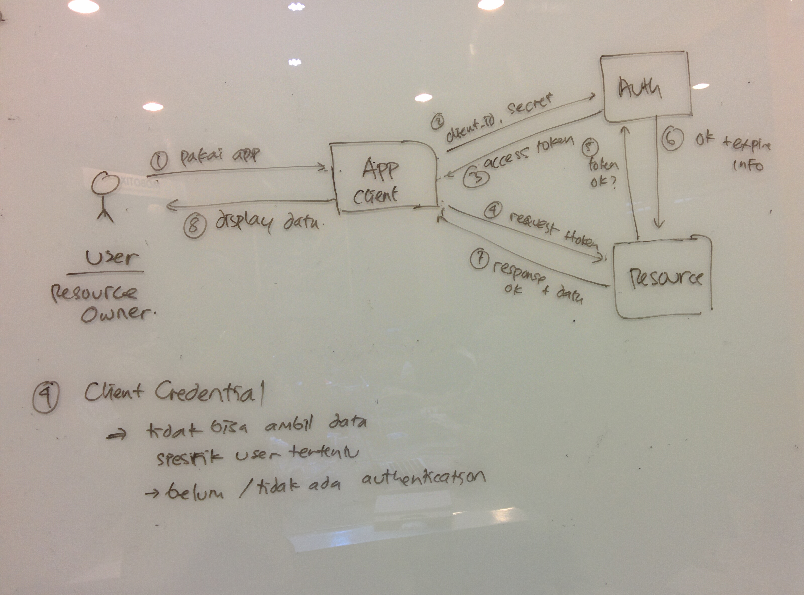

# OAuth 2.0 #

Use Case : 

* Single Sign On
* Outsource Sign On process

## OAuth Flow ##

OAuth 2.0 memiliki 4 jenis flow:

1. Authorization Code
2. Implicit
3. User Password
4. Client Credential

### Authorization Code ##

### Implicit ###

### User Password ###

### Client Credential ###

